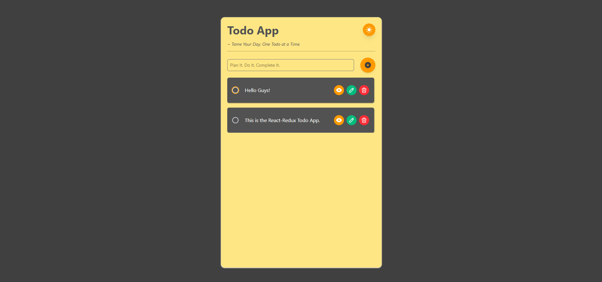
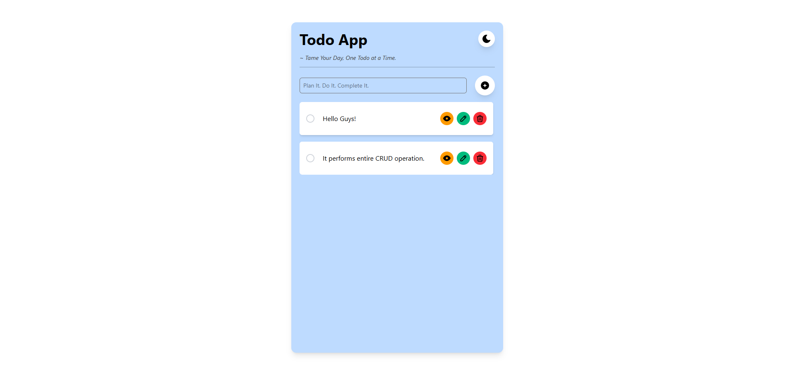

# ⚛️ React + Redux Toolkit Todo App (CRUD)

[](https://reactjs.org/)
[](https://redux-toolkit.js.org/)
[](https://tailwindcss.com/)
[](https://vitejs.dev/)
[](https://www.npmjs.com/)

A sleek, professional **Todo App** built with **React**, **Redux Toolkit**, and **Tailwind CSS**, implemented with full **CRUD** (Create, Read, Update, Delete) functionality, **local persistence**, and a **Light / Dark theme toggle**. The project uses `npm` for development and build tasks.

---

## 📸 Todo UI

 <br><br>


---

## 📸 Todo UI Video


---

## 🔧 Key Features

- Full CRUD support:
  - Create new todos
  - Read / view todo details (modal)
  - Update (inline edit with keyboard support)
  - Delete single todos
- Toggle todo status (complete / incomplete) with visual feedback:
  - Completed items: strike-through, fade, and automatic move to bottom (incomplete-first sorting)
- Light / Dark theme toggle with persisted preference
- Persistent todos using `localStorage` (survive page reload)
- Responsive, accessible, and professional UI built with Tailwind CSS
- State management with Redux Toolkit (`createSlice`, `configureStore`, `useSelector`, `useDispatch`)
- Built with Vite for a fast dev experience
- Uses `npm` for dependency management and scripts

---

## 🗂 Project Structure

```bash
redux-todo-app/
│
├── node_modules/
├── public/
│
├── src/
│ ├── app/ # Redux store (store.js)
│ ├── assets/ # Images / icons / mock data
│ ├── components/ # Reusable components (Modal, Header, TodoList, TodoItem)
│ ├── contexts/ # AppContext for theme & modal state (optional)
│ ├── features/ # Redux slices (todoSlice.js)
│ ├── pages/ # Page components (if applicable)
│ ├── App.jsx # App wrapper
│ ├── main.jsx # React entry (with Provider)
│ ├── index.css # Tailwind + global CSS
│
├── .gitignore
├── package.json
├── README.md
├── tailwind.config.cjs
├── vite.config.js
└── postcss.config.cjs
```

## 🚀 Quick Start (npm)

### 1. Clone

```bash
git clone https://github.com/your-username/todo-redux.git
cd redux-todo-app
```

### 2. Install

```bash
npm install
```

### 3. Run (development)

```bash
npm run dev
```

### 4. Build (production)

```bash
npm run build
```

### 5. Preview (production build)

```bash
npm run preview
```

## 📦 Tech Stack

| Tool                                           | Purpose                                |
| ---------------------------------------------- | -------------------------------------- |
| [React](https://reactjs.org/)                  | Frontend UI library                    |
| [Redux Toolkit](https://redux-toolkit.js.org/) | Scalable global state management       |
| [React Redux](https://react-redux.js.org/)     | React bindings for Redux Toolkit       |
| [Tailwind CSS](https://tailwindcss.com/)       | Utility-first styling framework        |
| [Vite](https://vitejs.dev/)                    | Fast development server and build tool |
| [npm](https://www.npmjs.com/)                  | Package manager for dependencies       |

## 🎨 UI & UX

### ✏️ Inline Edit

- Click **Edit** → `editingId` is set → input appears pre-filled.
- Save with **Enter key** or **Save button** to dispatch `updateTodo`.
- During edit, other controls use `pointer-events-none`; input uses `pointer-events-auto`.

### 👁️ View Modal

- Click **View** → sets `modalInfo` → opens modal (`view` state).
- Modal receives `todo` prop and displays details.
- Uses `(todo ? ... : ...)` safe check to avoid crashes.

### 🔄 Sorting & Animations

- Incomplete todos appear before completed ones:
  ```javascript
  .sort((a, b) => a.status - b.status)
  ```

---

### ♿ Accessibility

- Buttons have `title` attributes & accessible labels.
- Focus-visible rings for keyboard navigation via Tailwind’s `focus:` utilities.
- Inputs auto-focus in edit mode for keyboard-friendly editing.

### **3. Contributing Guidelines**

Professional projects usually have a short contributing section.

```markdown
🤝 Contributing

Contributions are welcome!

1. Fork this repo.
2. Create a new branch: `git checkout -b feature-name`
3. Commit your changes: `git commit -m "Added new feature"`
4. Push to your branch: `git push origin feature-name`
5. Open a Pull Request.

Please follow the existing code style and write clear commit messages.
```

## 📃 License

This project is licensed under the [MIT License](https://opensource.org/licenses/MIT) — feel free to use, modify, and distribute for personal or commercial use.
